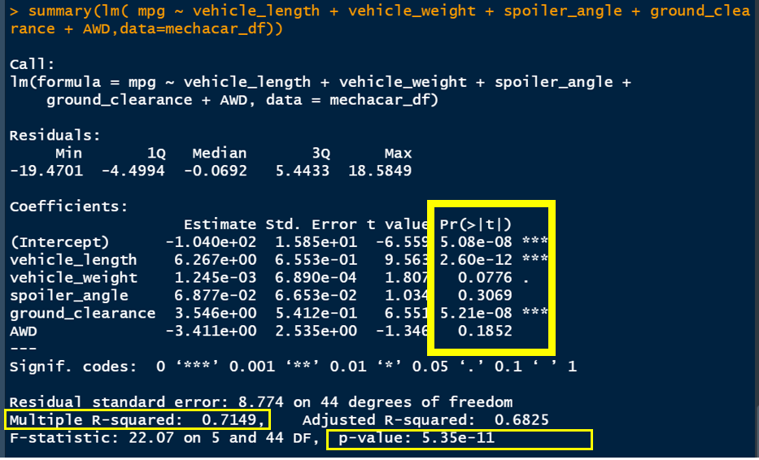
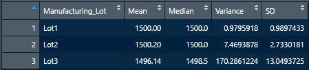
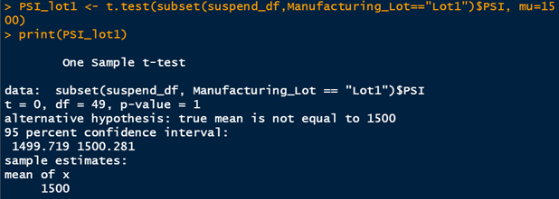
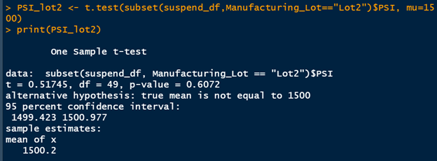
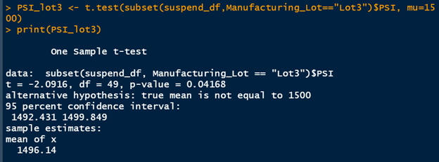

## MechaCar Statistical Analysis

### Purpose: Statistical Analysis on Car Performance

## Linear Regression to Predict MPG

MechaCar prototype metrics have been gathered so that correlations between the prototype's features (vehicle_length, vehicle_weight,spoiler_angle, ground_clearance and AWD) and MPG can be discovered. The linear modeling function (*****lm()*****) was used to be able to find feature(s) needing to be used to predict MPG in MechaCar prototypes.

The above image shows the linear modeling function's results.

Observing the coefficients p-values (Pr(>|t|) columns, it becomes obvious it is the vehicle’s length and ground clearance having the most statistical significance. They provide a non-random amount of variance to the mpg values in the dataset. It is these two variables needing to be used while predicting MPG of the prototypes. These are the two variables having the highest probablity of correlation with MPG.

As for the the overall p-value, we can see it is also significantly smaller than that of the normal statistical significants of 5%. This lets us know the data sample being used does have a statistical significants. We are justified in using this data.

Lastly, the multilpel R-squared (coefficient of determination) lets us know that the data model used has a 71.49% of the variability of our dependent
variable (mpg) explained using the linear model. I don't know how this compares with other data models; however, 71.49% is reasonably high.

Summary: There is a linear relationship between the prototype's features and MPG; therefore, the slope of the line should be nonzero. The metrics, length of cars and ground_clearance can be used for linear regression modeling for the prediction of MPG.

## Summary Statistics on Suspension Coils

The design specifications for MechaCar suspension coils states the variance of the suspension coils must not exceed 100 pounds per square inch. To test this, we first capture the summary statistics of all suspension coils (below).

For the entire sampling we can see the variance is only 62.29356. So, initially, it appears the suspension coils pass specifications.

However, when we compare each lots statistics (above), it becomes obvious there is a large variance in Lot3's sample. The manufactureing process is not consistent across production lots.

Summary: There are a few concerns needing to be address. The design specification of 100 PSI does not state whether this is a plant-wide statistical specification or whether it is an expected outcome per lot. The design specifications need to be corrected by the team owning the design specifications.
Next, Lot3 is showing a LARGE variance, lot3's data (as well as the machines used to create lot 3's coils) needs to be investigated and addressed properly.

## T-Test on Suspension Coils

The one-sample t-test is used to determine whether there is a statistical difference between the means of a sample dataset and a hypothesized, potential population dataset.

The first t-test (shown below) is performed on the entire dataset. The resulting data from the t-test shows us a p-value of .06028. This p-value is above the normal statistical significance level of 5%. Therefore, the p-value indicates the null hypothesis shouldn't be rejected and the means are statistically similar.

The other t-tests performed are on each of the dataset's lot number subsets. The first and second lots, Lot1 and Lot2, each show a p-value agreeing with the entire dataset's results.

It is not until we observe Lot3's resulting t-test that we are able to see a statistical significace level of 5%.

Summary: We do not have sufficient evidence to reject the null hypothesis for lots 1 and 2 however, and we would state that the two means are statistically similar.

## Design a Study Comparing the MechaCar to the Competition

